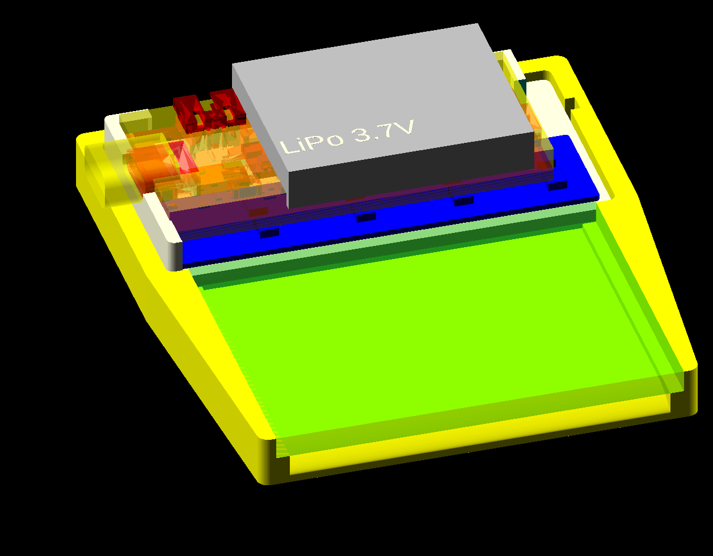
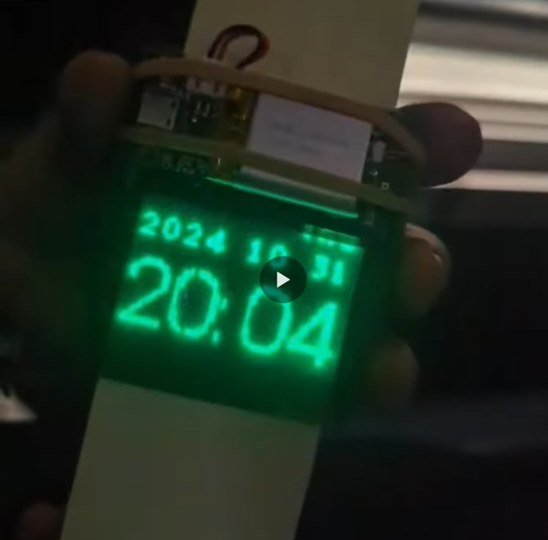

# Glowtape

Glow-in-the-dark display, 64 pixels wide, and as long as the memory allows :)

Using a UV LED pixel illumination from the [Glowxels](http://glowxels.org)
project.

[Note: this is pretty much work in progress and not the final version.]

To build: get all dependencies (if you're using nix, or the nix package manager,
it is simplest, they are in shell.nix).
Mostly openscad for the case, rp2040 sdk and toolchain for the firmware,
[bdfont.data](https://github.com/hzeller/bdfont.data) to compactly encode fonts
used in the firmware and the [gcode-cli](https://github.com/hzeller/gcode-cli)
used in the [set-time utility](./set-time.sh).

  * [casing/](./casing/) for the OpenSCAD case 
  * [firmware/](./firmware/) contains the firmware.
  * [Gloxwls PCB](http://glowxels.org/). Check out the ['narrow'](https://github.com/hzeller/glowxels/tree/feature-20240902-narrow) feature branch.
  * [Encoder PCB](./pcb/encoder/) to pick up the encoder tape.
    Just type `make` to generate the fab files.
  * The sync-tape to be stuck to the back of the 50mm glow-in-dark
    tape: just `make` in the toplevel directory, it creates the PDF from
    the hand-written PostScript. Print on a high-resolution printer
    (e.g. 1200dpi) to minimize line-thickness variations due to aliasing.
  * Also some glow-in-dark tape that you can find in a hardware store, e.g.
    soemthing like [this](https://www.amazon.com/gp/product/B076BMQHXB)
    (no affiliation).

The RP2040 RTC does not remember its time after a reset (meh), so you need to
call the `./set-time.sh` script after a flash or reset/battery outage.

## Action shot

